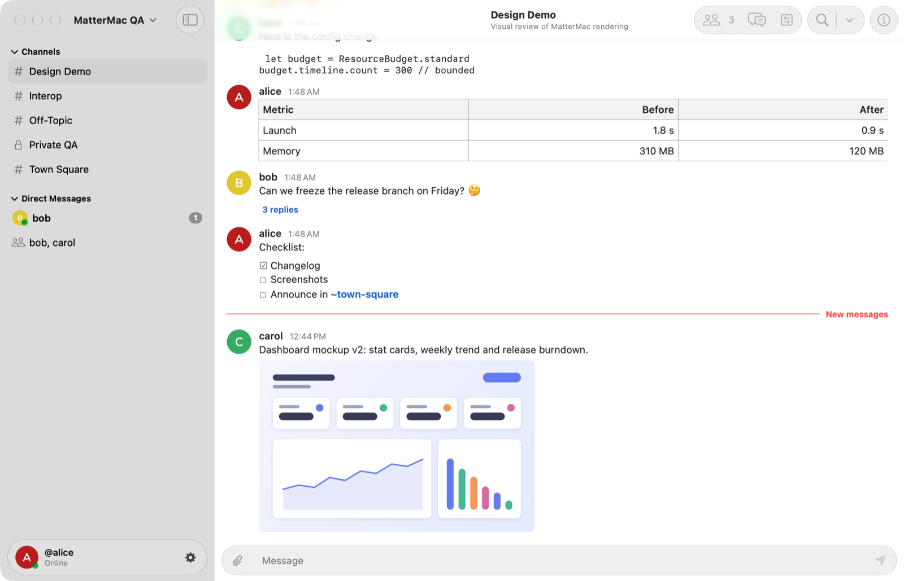
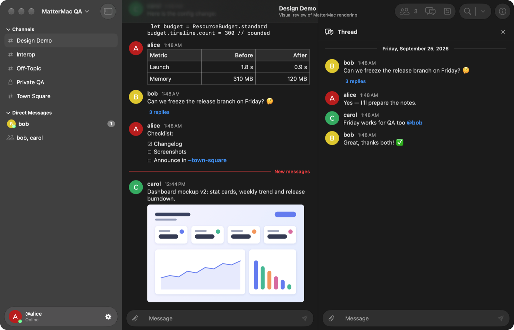
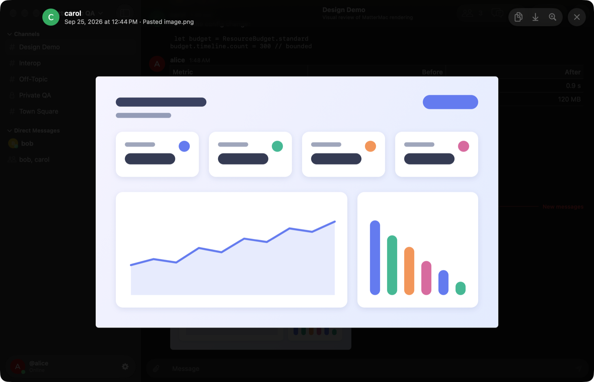

# MatterMac

An independent native macOS client for existing Mattermost servers, built with
SwiftUI, AppKit, Swift 6, and Apple frameworks. No Electron, no web view, and no
external runtime dependencies. This is a development checkpoint, not an official
Mattermost application or a release candidate.

<picture>
  <source media="(prefers-color-scheme: dark)" srcset="docs/images/conversation-dark.png">
  
</picture>

| Threads beside the conversation | In-window image viewer |
| --- | --- |
|  |  |

<sub>Screenshots show synthetic test users and content on a local test server
(see [asset provenance](docs/assets.md#readme-screenshots)).</sub>

## Highlights

- **Native and light.** A SwiftUI shell with an AppKit timeline and composer that
  render Markdown, tables, task lists, code and emoji natively. Memory, tasks and
  caches are bounded by one resource budget.
- **Fast to open.** An encrypted on-device cache shows your channels, profiles,
  images and recent messages at once, then refreshes them from the server.
- **Liquid Glass on macOS 26 and later** (earlier systems get material
  fallbacks). Floating account and composer controls, a jump-to-latest pill, and
  a full-window image viewer with zoom and keyboard navigation.
- **Works with your server as it is.** Password, access-token and browser SSO
  sign-in; channels, direct and group messages, threads, reactions, search,
  uploads and notifications. Tested on Mattermost 10.11 and 11.11, including
  subpath deployments.

## Build and run

The verified development toolchain is **Xcode 27.0 / Apple Swift 6.4** on macOS 27.
The app targets **macOS 14 or later**; execution on macOS 14 and Intel hardware has
not yet been verified. Open `MatterMac.xcworkspace`, select the MatterMac scheme,
and run, or use these commands from the repository root:

```sh
swift test --package-path Packages/MatterMacKit
xcodebuild -workspace MatterMac.xcworkspace -scheme MatterMac \
  -configuration Debug -derivedDataPath build build
open build/Build/Products/Debug/MatterMac.app
```

Enter your server address, choose Continue to review the normalized address, then
Connect. Release builds require HTTPS. For the repository's local test servers,
Debug builds accept `-MatterMacAllowInsecureLoopback YES`.

Local builds use ad-hoc signing. Developer ID signing and notarization have not
been performed; there is no signed public release yet.

## Current scope

- Password/PAT login, browser SSO handoff, and Keychain sign-in restoration.
- Channels, DMs/group messages, collapsed threads, unread state, edits/deletions,
  reactions, saved/pinned messages, and server message/file search.
- Native Markdown tables, task lists, code/quotes and attachment cards; system and
  custom emoji with completion, plus server slash-command suggestions.
- File upload/download, pasted images, avatars, an in-window image viewer, and
  profile editing with bounded profile-picture upload.
- Multiple server sessions, keyboard navigation, server notification preferences,
  opt-in macOS notifications, automatic online/away status, and session-only
  appearance/settings.
- Session recovery notices and Review Unsent Work: copy individual drafts or
  unconfirmed sends, export pasted images, and confirm local discard.

Live tests cover REST/WebSocket messaging and native conversation/attachment flows
on Mattermost **10.11.24**, **11.11.1**, and **11.11.1 under a URL subpath**. These
checks use two native clients. A separate real-app check verifies bidirectional
channel/DM exchange with the official web client on 11.11.1, including fetching
both conversations after relaunch and reauthentication. Browser SSO supports server-advertised routes, but individual identity
providers still require deployment testing. See [compatibility](docs/compatibility.md)
and the dated [verification record](docs/progress.md).

Calls, arbitrary web plugins, Boards, Playbooks dashboards, and administration are
outside the native messaging scope. Interactive command dialogs and ephemeral bot
posts remain unsupported. Accessibility, real IMEs, minimum-OS execution, privacy
audits, and full application performance gates remain incomplete. The synthetic
native rendering measurements are recorded in [benchmarks](docs/benchmarks.md).
A [two-hour app soak](docs/soak.md) exposed a native row-retention defect, now fixed
and covered by a failing-before/passing-after regression. The corrected app still
needs a sustained foreground remeasurement; macOS locked before that final run.

## What is saved

- **Sign-ins:** verified sign-ins are saved in the local macOS Keychain (bearer
  token and kind, canonical server address, and account ID). Passwords are never
  saved. Saved identity is checked on launch; server expiry or revocation can
  still require another sign-in.
- **Content cache:** to open quickly, MatterMac keeps a cache in its sandbox Caches
  directory. It holds image bytes (avatars, team icons, attachment thumbnails and
  previews, custom emoji), the channel list and profiles, the last open channel,
  and the latest messages of recently opened channels. Every file is encrypted
  with a per-account key kept in Keychain. The cache is bounded (512 MiB of images,
  96 MiB of other content) and excluded from backups. Cached messages are only
  shown until the server answers, and never mark a channel read.
- **Quit keeps both; Sign Out removes that account's sign-in, cache and key.**
  Settings ▸ Accounts shows the cache size and has **Clear Cache**. See
  [decision 0031](docs/decisions/0031-on-device-content-cache.md).
- **Drafts:** drafts, pending sends, pasted images, and local preferences stay in
  bounded memory. **Drafts do not survive quit, a crash, or forced termination.**
  Drafts and pending sends share a 100-item / 4 MiB text budget; pasted images
  share 8 MiB. New work is refused at the limit without evicting existing unsent
  work. Review Unsent Work in the Session menu before leaving the app.

Uploads begin on Send. Uploaded files can remain on the server if their message
is never posted. Downloads and image exports write only when explicitly chosen;
copying content also hands it to the system clipboard. The server retains sent
messages according to its own policy. macOS swap, system diagnostics, browsers,
and external applications are outside the app-managed storage guarantee. A full
filesystem audit has not yet run.

## Contributing

See [CONTRIBUTING.md](CONTRIBUTING.md) for local servers, opt-in tests, and review
expectations; [architecture](docs/architecture.md) for code ownership; and
[SECURITY.md](SECURITY.md) for reporting security issues. Do not include credentials
or private server content in public reports.

Licensed under the [MIT License](LICENSE).
