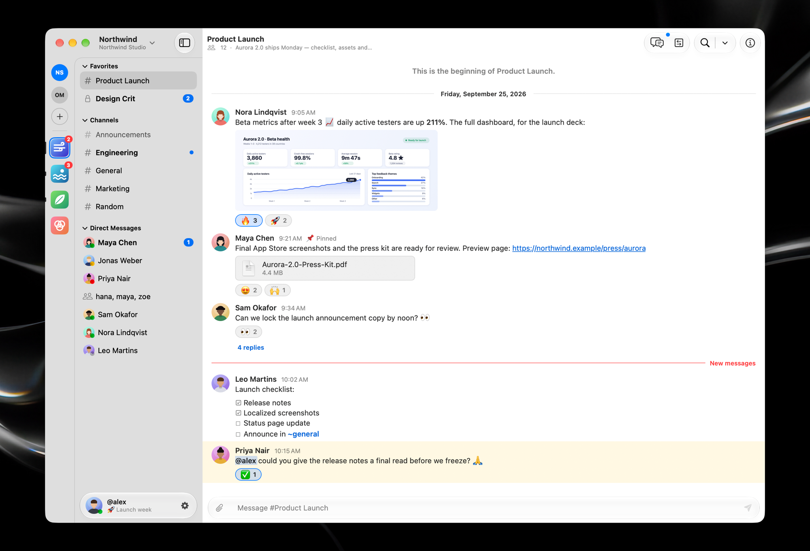
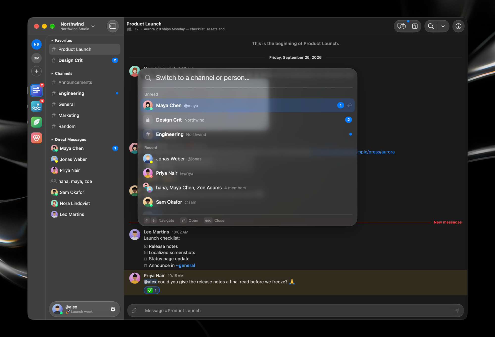
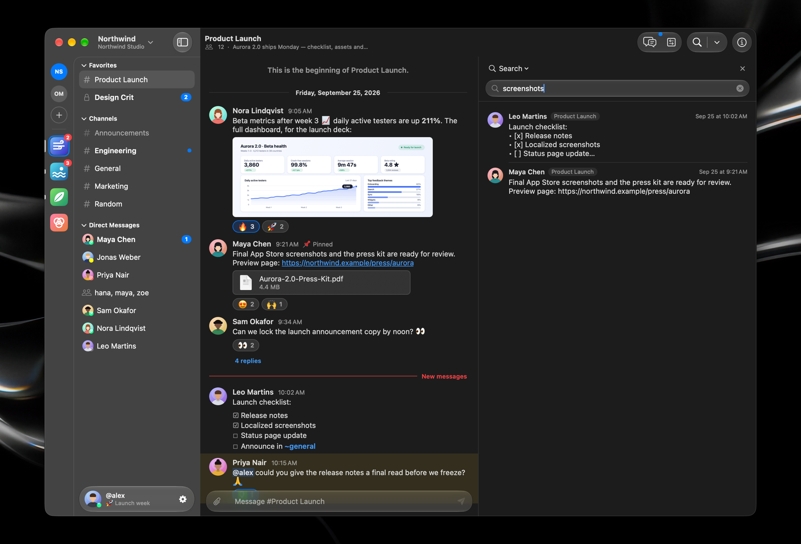
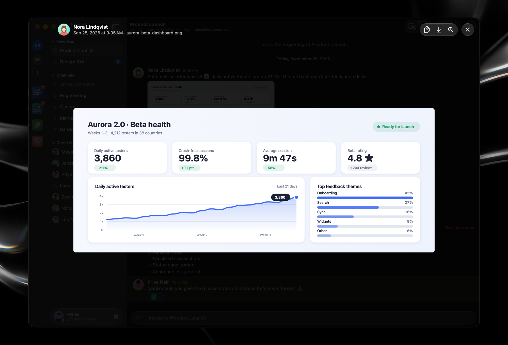
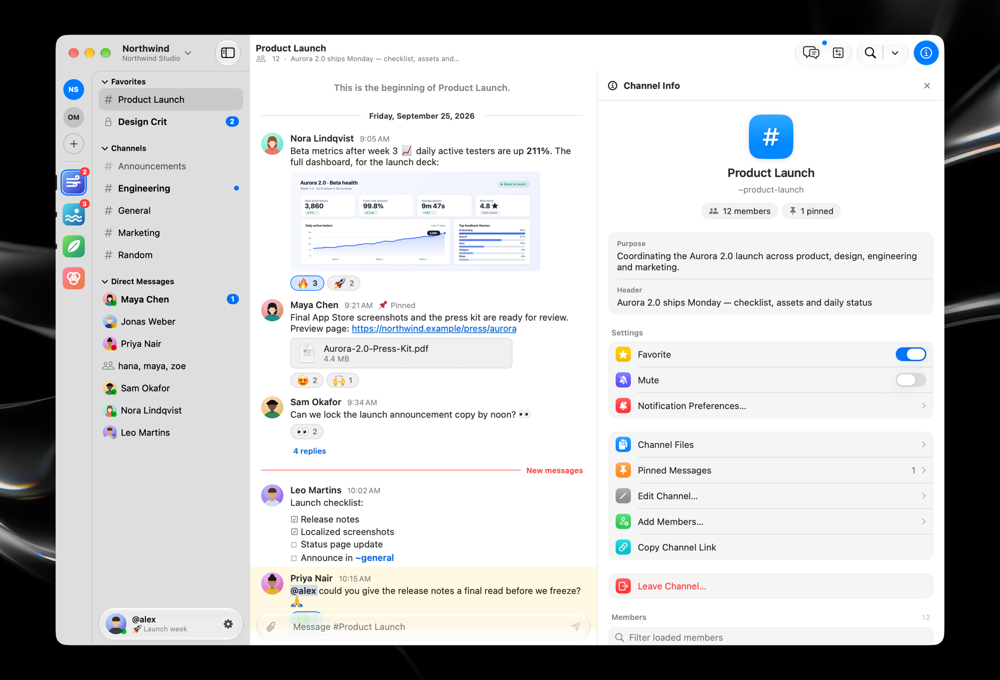
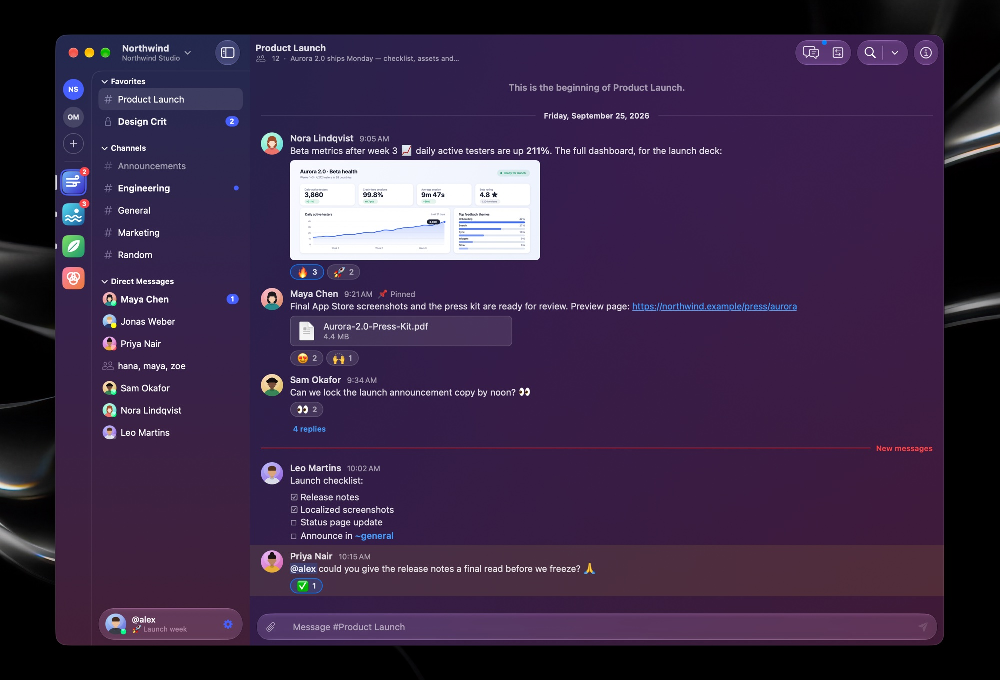
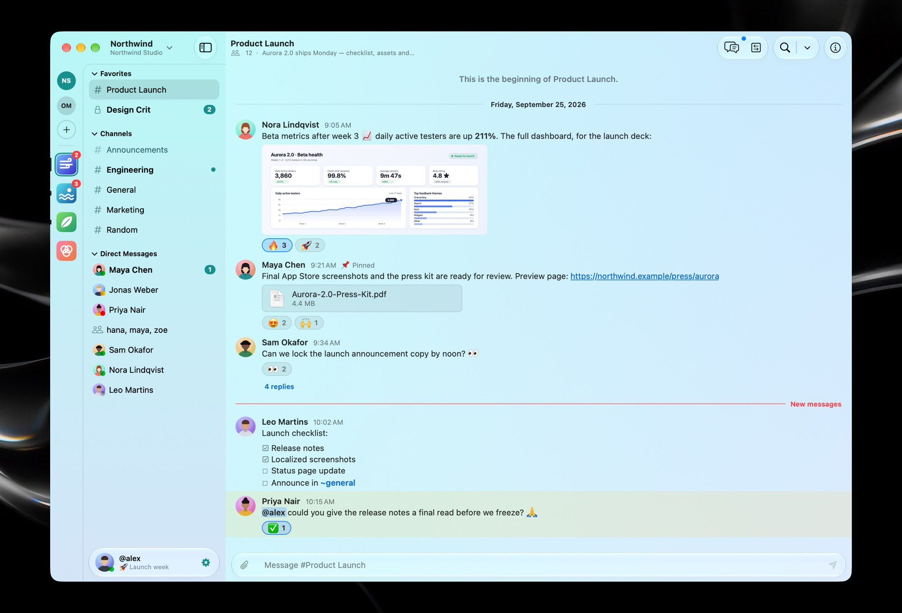
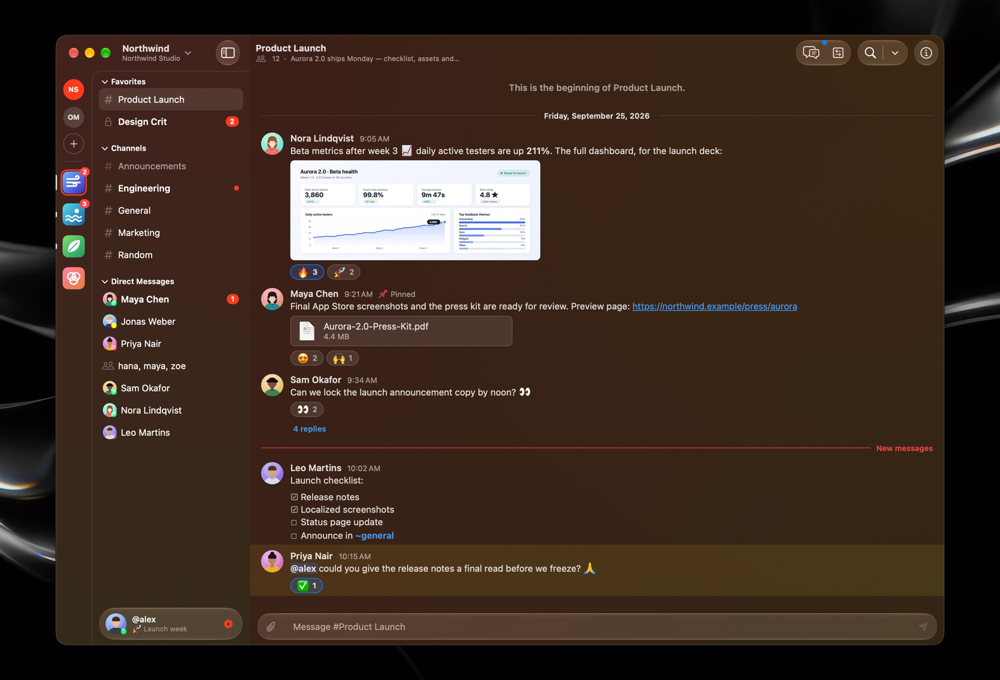
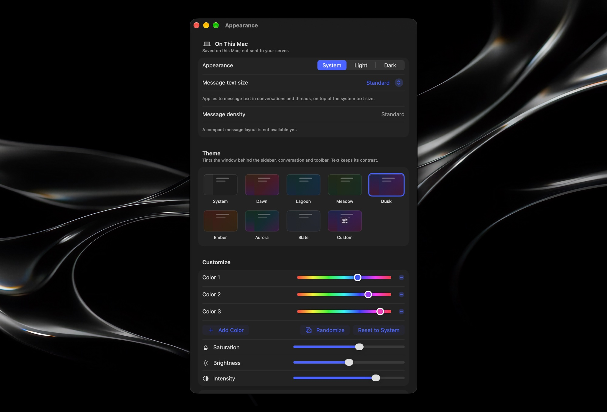
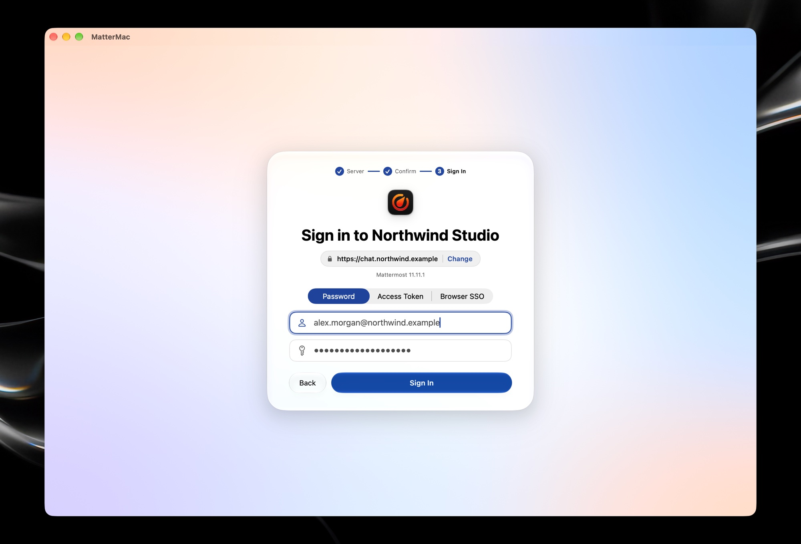

<p align="center">
  
</p>

<h1 align="center">MatterMac</h1>

<p align="center">
  <b>A fast, native macOS client for your existing Mattermost servers.</b><br>
  100% Swift, built with SwiftUI and AppKit. No Electron and no web view.
</p>

<p align="center">
  <a href="https://github.com/dfrnoch/MatterMac/releases"></a>
  
  
  <a href="LICENSE"></a>
</p>

<p align="center">
  <a href="https://github.com/dfrnoch/MatterMac/releases"><b>Download</b></a> ·
  <a href="#features">Features</a> ·
  <a href="#build-from-source">Build from source</a> ·
  <a href="#privacy-and-storage">Privacy</a> ·
  <a href="#status">Status</a>
</p>

<picture>
  <source media="(prefers-color-scheme: dark)" srcset="docs/images/hero-dark.png">
  
</picture>

> [!NOTE]
> MatterMac is an independent project, not an official Mattermost application.
> It is under active development: nightly builds are published every day, and
> there is no production release yet.

## Features

### Conversations that feel at home on the Mac

Markdown, tables, task lists, code blocks, quotes, emoji and attachment cards are
all rendered natively, and threads open in a pane beside the channel. Reactions,
edits, pinned and saved messages, unread lines and mentions work the way you expect
from Mattermost.

<p align="center">
  
</p>

### Jump anywhere, find anything

Press <kbd>⌘</kbd> <kbd>K</kbd> to switch to any channel, direct message or person.
Results are ranked by how well they match, unread conversations come first, and
matching ignores accents. Server-wide message and file search is built in.

| Quick switcher | Search |
| --- | --- |
|  |  |

### Images, files and channel details

Images open in an in-window viewer with zoom, keyboard navigation, copy and save.
Channel Info collects the purpose, header, members, pinned messages, files and
per-channel settings.

| Media viewer | Channel Info |
| --- | --- |
|  |  |

### Make it yours

Pick a window theme, or mix your own gradient from two to four colours. Themes tint
the sidebar, conversation and Liquid Glass chrome, in light and dark mode. MatterMac
reduces any tint that would make text hard to read.

| Dusk | Lagoon | Ember |
| --- | --- | --- |
|  |  |  |

<p align="center">
  
</p>

### Signs in the way your server does

Sign in with a password (including MFA), a personal access token, or browser-based
SSO. Several servers can stay signed in at once, and sign-ins are restored from the
macOS Keychain at launch.

<picture>
  <source media="(prefers-color-scheme: dark)" srcset="docs/images/sign-in-dark.jpg">
  
</picture>

### And the rest

- **Native and light.** A SwiftUI shell with an AppKit timeline and composer.
  Memory, tasks and caches are all bounded by one resource budget.
- **Fast to open.** An encrypted on-device cache shows your channels, profiles,
  images and recent messages at once, then refreshes them from the server.
- **Liquid Glass** on macOS 26 and later, with material fallbacks on macOS 14 and 15.
- **Everyday essentials:** file uploads and downloads, pasted images, custom emoji
  with completion, slash-command suggestions, and editing your profile and status.
- **Mac integration:** notifications with message previews (on by default), automatic
  online and away status, keyboard shortcuts for navigation, and a Dock badge.
- **Nothing lost silently.** Review Unsent Work lets you copy drafts or unconfirmed
  sends and export pasted images before you discard them.
- **Keeps itself up to date** from GitHub releases, on the Stable or Nightly channel.

## Install

1. Download the latest DMG from [Releases](https://github.com/dfrnoch/MatterMac/releases).
   Every build is signed with a Developer ID and notarized by Apple.
2. Open it and drag **MatterMac** to Applications.
3. Enter your server address and choose **Continue**. Check the address MatterMac
   will connect to, choose **Connect**, then sign in. Release builds require HTTPS.

MatterMac checks GitHub for updates at launch and every six hours, verifies what it
downloads, and offers **Restart to Update**. Choose the channel in
Settings ▸ General ▸ Updates.

## Build from source

You need **Xcode 27** (Swift 6.4). The app runs on **macOS 14 or later**, though
macOS 14 and Intel Macs have not been verified yet. Open `MatterMac.xcworkspace`
and run the MatterMac scheme, or use these commands from the repository root:

```sh
swift test --package-path Packages/MatterMacKit
xcodebuild -workspace MatterMac.xcworkspace -scheme MatterMac \
  -configuration Debug -derivedDataPath build build
open build/Build/Products/Debug/MatterMac.app
```

- **Local test servers:** Debug builds accept `-MatterMacAllowInsecureLoopback YES`.
  The Docker setup is in [CONTRIBUTING.md](CONTRIBUTING.md).
- **No Developer ID certificate?** See [releasing](docs/releasing.md#signing) for the
  ad-hoc signing override.
- **Releases:** the nightly and production pipelines, versions, in-app updates and
  secrets are all documented in [docs/releasing.md](docs/releasing.md).

## Privacy and storage

MatterMac talks only to your Mattermost servers, plus GitHub to check for updates.
It never sends account or message data to GitHub.

| What | Where | Details |
| --- | --- | --- |
| **Sign-ins** | macOS Keychain | Bearer token and kind, server address and account ID. Passwords are never saved. |
| **Content cache** | Sandbox Caches, encrypted | Images, profiles, the channel list and recent messages. Encrypted with a per-account key kept in Keychain, capped at 512 MiB of images and 96 MiB of other content, and excluded from backups. Cached messages never mark a channel read. |
| **Settings** | MatterMac's preferences | The "On This Mac" values: notifications, previews, sound, Dock bounce, send behavior, text size, appearance and theme. |
| **Drafts** | Memory only | Drafts, pending sends and pasted images stay in bounded memory. **They do not survive quit, a crash, or forced termination.** |

Quitting keeps sign-ins and the cache; **Sign Out** removes that account's sign-in,
cache and key. Settings ▸ Accounts shows the cache size and has **Clear Cache**.

- **Limits:** drafts and pending sends share a budget of 100 items or 4 MiB of text,
  and pasted images share 8 MiB. At the limit MatterMac refuses new work rather than
  evicting unsent work.
- **Uploads** start when you send; files can stay on the server if their message is
  never posted.
- **Downloads and exports** are written only when you choose to.
- **Outside the app's control:** macOS swap, system diagnostics and other apps. A
  full filesystem audit has not run yet.

See decisions [0031](docs/decisions/0031-on-device-content-cache.md) and
[0032](docs/decisions/0032-saved-local-settings-and-notifications.md).

## Status

**Tested server versions.** Live tests cover REST and WebSocket messaging, and the
native conversation and attachment flows, on Mattermost **10.11.24**, **11.11.1**,
and **11.11.1 under a URL subpath**.
- Both peers in these tests are native clients.
- A separate real-app check exchanged channel and DM messages both ways with the
  official web client on 11.11.1, including after relaunch and sign-in again.
- Browser SSO supports the routes a server advertises, but each identity provider
  still needs testing on a real deployment.

See [compatibility](docs/compatibility.md) and the dated
[verification record](docs/progress.md).

**Out of scope:** Calls, arbitrary web plugins, Boards, Playbooks dashboards and
administration. Interactive command dialogs and ephemeral bot posts are not
supported yet.

**Still open:**
- Accessibility, real input methods (IMEs), running on the minimum macOS version,
  privacy audits and full performance gates are incomplete.
- Synthetic rendering measurements are in [benchmarks](docs/benchmarks.md).
- A [two-hour soak](docs/soak.md) found a row-retention defect. It is fixed and
  covered by a regression test that failed before the fix, but still needs a
  sustained foreground remeasurement.

<sub>Screenshots show synthetic people and content, generated entirely in process
by an opt-in test (see [asset provenance](docs/assets.md#readme-screenshots)).</sub>

## Contributing

- [CONTRIBUTING.md](CONTRIBUTING.md): local servers, opt-in tests and review
  expectations.
- [Architecture](docs/architecture.md): how the code is organised.
- [SECURITY.md](SECURITY.md): how to report security issues.

Please keep credentials and private server content out of public reports.

Licensed under the [MIT License](LICENSE).
